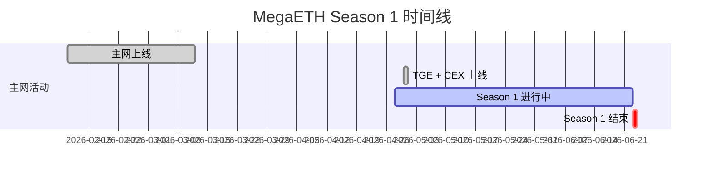

## 项目背景：以太坊最快的 L2

MegaETH 是一条高性能以太坊 Layer 2，主打**实时执行**：100,000+ TPS、sub-10ms 出块时间，且完全兼容 EVM。它的技术路线是用极致性能解决 L2 的扩展瓶颈，目标不是「又一个 Rollup」，而是让链上体验接近 Web2 的流畅度。

项目由 Dragonfly Capital 领投，累计融资 **$87.68M**，并获得以太坊联合创始人 **Vitalik Buterin** 公开支持。2026 年 2 月主网上线，4 月 30 日原生代币 **$MEGA** 同步登陆 Binance 及 13+ 交易所。

> 当前 Terminal Odyssey Season 1 截止日期：**2026 年 6 月 23 日**，剩余不到 4 周。

## 空投规模有多大？

MegaETH 将**总供应量的 2.5%** 分配给主网活跃用户（Terminal Season 1），按当前 FDV 估算约 **$40M**。注意这里是额外的活动分配——不算 Flux 质押（占总量 53%）和其他生态激励。

这意味着：你现在做的每一个交互，都直接对应 Season 1 结束时的 $MEGA 分配。

## 第一步：接入 Terminal 平台

核心入口：[terminal.megaeth.com](https://terminal.megaeth.com)

操作流程：

```bash
# 1. 连接 EVM 钱包（推荐 MetaMask / Rabby）
# 2. 绑定 X（Twitter）账号
# 3. 通过 RabbitHole 将 ETH 跨链至 MegaETH 主网
```

跨链后你会看到 Terminal 的 App Map，上面列出了所有生态 dApp。你的目标是：**尽可能多、尽可能深地与这些应用交互**。

## 第二步：Booster 机制——每周 3 个名额，选对很关键

Terminal 的核心规则：

- **每周可选 3 个 dApp 应用 Booster 乘数**，提升对应应用的积分收益
- 乘数叠加到该应用的所有交互上
- 每周可以更换选择

⚠️ **策略建议**：不要分散到所有应用，专注 3 个最高 ROI 的应用集中刷。深度 > 广度，这是 MegaETH 团队明确的态度。

## 第三步：加入 Clan（族群）

Terminal 内置了 Clan 系统，加入后可获得**集体积分加成**：

| Clan 名称 | 关联 NFT | 门槛 |
|-----------|---------|------|
| BadBunnz | Bad Bunnz | 地板价 ~0.15 ETH（~$343） |
| Nacci Cartel | — | 免费加入 |
| WCNetizens | — | 免费加入 |
| Megalio | — | 免费加入 |
| Miniminds | — | 免费加入 |

- **持有 NFT 不是加入 Clan 的硬性条件**，但持有对应 NFT 可额外叠加积分乘数
- **低成本 NFT 路线**：Legend of Breadio 系列，单价约 $20（0.0098 ETH），堆 3 个即可获得最大乘数
- Bad Bunnz 是 MegaETH 旗舰 NFT，目前地板价 ~$343，加成效果最强

## 第四步：生态 dApp 逐个击破

以下是目前 Terminal 上最值得交互的 8 个应用，按优先级排列：

### 1. Prism — DeFi 超级应用（强烈推荐）

MegaETH 上的全栈 DeFi 平台，集成了现货 DEX、永续合约、借贷和预测市场，由 BadBunnz 团队打造。

**刷分操作：**
- 在 Prism 上进行 token swap（ETH ↔ USDM）
- **重点**：为 MEGA-USDM 池提供流动性，APR 可达 **100%+**，使用宽幅范围可减少无常损失
- 参与预测市场下注

> 风险等级：🟢 低，标准 DeFi 操作

### 2. GMX — 老牌永续合约平台

GMX 已部署至 MegaETH，带来成熟的高流动性合约交易体验。

**刷分操作：**
- 开仓交易（建议用最小仓位）
- 理想策略：在 GMX 做多 ETH，同时在 World Markets 做空等量 ETH，实现**Delta 中性**，零风险敞口赚积分

> 风险等级：🟡 中，交易本身有市场风险

### 3. World Markets — 统一保证金交易

支持现货、永续合约、信用循环交易，单一抵押池管理所有仓位。

**刷分操作：**
- 目前处于 beta 阶段，积分系统即将上线
- 可与 GMX 组合实施 Delta 中性策略

> 风险等级：🟡 中

### 4. Ubitel — 去中心化 eSIM（低风险推荐）

覆盖 200+ 国家的去中心化 eSIM 市场，用加密货币购买移动数据套餐。

**刷分操作：**
- 购买一次小额数据套餐即可计入 Terminal 积分
- 你得到的是**真实产品**（手机流量），不是纯刷分

> 风险等级：🟢 低，实际消费获得真实服务

### 5. Ave Forge — 机甲对战游戏

MegaETH 原生链游，玩家操控可定制机甲进行实时 PvP/PvE 战斗，采用剪刀石头布式的策略机制——**技术 > 氪金**。

**刷分操作：**
- 参与 PvE 战斗积累积分
- Genesis NFT 持有者还能从市场手续费中获得被动 ETH 收入
- 不建议大量购买 lootbox，回报期望为负

> 风险等级：🟡 中

### 6. Tulpea — RWA 房地产信贷（$TULIP 已确认！）

MegaETH 上首个结构化房地产信贷协议。巴厘岛 Genesis Villa 的租金收入上链，收益来源于真实租金而非代币排放。

**刷分操作：**
- 存入资金获取 RWA 收益
- **✅ $TULIP 代币空投已确认！** TGE 日期待公布

> 风险等级：🟡 中，RWA 收益更稳定但存在智能合约风险

### 7. Hit.One — 千倍杠杆合约平台

提供最高 **1000x** 杠杆的永续合约交易。

**刷分操作：**
- 最小仓位开仓，务必开启 Profit Guard
- 积分 + 推荐系统指向未来 TGE

> 风险等级：🔴 高，高杠杆可能导致爆仓

### 8. MnStr — 链上宝可梦卡牌

类似 Pokémon 的链上 TCG 游戏，购买卡包、开卡、交易。

**刷分操作：**
- 购买少量卡包获取积分
- ⚠️ 每包期望回报约 -20%（庄家优势），**把卡包成本视为刷分开销，不是投资**

> 风险等级：🔴 高

## 第五步：Flux 质押系统——53% 供应量的真正大头

这是绝大多数人忽略的核心机制。MegaETH 的 **Flux** 是 KPI 驱动的质押系统，**控制着总供应量的 53%**。

### 工作机制：

```
存入 $MEGA → 90 天成熟期 → 达成 KPI 里程碑 → 释放奖励
```

- 每个质押仓位从 0% 开始，线性增长至 100%（90 天）
- **关键规则**：向已有仓位追加 $MEGA 会**重置成熟度到 0%**——每次加仓开新仓位，不要追加
- KPI 达标后触发 7 天倒计时，奖励按比例分配

### 当前 KPI 进展：

| KPI 目标 | 状态 |
|---------|------|
| MegaMafia 应用部署 | ✅ 已达成（4 月 23 日） |
| USDM 供应量 > $500M | ✅ 已达成（5 月 7 日） |
| 后续 KPI | 待公布 |

Flux 的核心逻辑是：**时间是你的朋友**。越早质押、质押越久，在 KPI 达成时分到的 $MEGA 越多。

## 时间线与策略总结



### 🎯 最优策略（按优先级）：

1. **入门必做**：跨链 ETH → 连接 Terminal → 加入免费 Clan
2. **每周必做**：选定 3 个 Booster 应用，集中交互
3. **高性价比**：Ubitel 买流量 + Prism 提供 MEGA-USDM LP
4. **进阶玩法**：GMX + World Markets 组合实现 Delta 中性
5. **长期布局**：Flux 质押 $MEGA，越早越好
6. **NFT 加成**：预算充足买 Bad Bunnz（~$343），预算有限堆 3 个 Legend of Breadio（~$60）

### 💡 MegaETH 团队原话：

> 「我们不想要短线 Farmer 在 TGE 当天砸盘。2.5% 的主网活动分配是给真正使用生态的用户，不是给刷量机器人的。一个用 5 种不同协议、持续 8 周的钱包，比一个一天刷 500 笔 swap 的钱包更受青睐。」

## 风险提示

- 所有 DeFi 协议存在**智能合约风险**，使用前务必 DYOR
- 杠杆交易可能导致全部资金损失
- NFT 存在流动性风险，地板价可能波动
- 本文不构成投资建议，仅为信息分享

---

**时间不多了。Season 1 倒计时：不到 4 周。现在开始，还来得及。**
